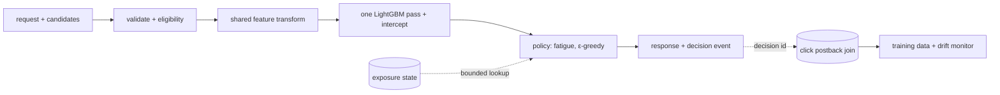

# simula-ctr

CTR prediction, candidate ranking, cold start, and drift for contextual ads inside AI companion apps. Take-home for Simula.

I used Codex and Claude Code for implementation; I chose the features, the evaluation, and the serving policy, and the decisions below are mine.

## Results in one table

Chronological split: development fit on Oct 21–26, feature set and tree counts selected on Oct 27, refit through Oct 27, calibrated on Oct 28, evaluated on Oct 29–30 (127,406 impressions, CTR 17.14%). The tables come from `reports/` and reproduce from the commands in **Run**; the extra data diagnostics quoted in prose were computed from the supplied CSVs.

| Model | Test log loss | Test AUC | Notes |
| --- | --- | --- | --- |
| Constant (train CTR) | 0.458740 | 0.500 | constant-probability baseline |
| Lookup `app_id × C18`, smoothed | 0.438968 | 0.640 | strongest lookup baseline |
| LightGBM A: request + candidate | 0.419189 | 0.706 | |
| **LightGBM B: A + character metadata** | **0.409450** | **0.729** | selected for the CLI; chosen on the Oct 27 selection day (A 0.4416, B 0.4332, C 0.4366) |
| LightGBM C: B + `character_id` | 0.411285 | 0.725 | adding character id did not improve this comparison |

B reduces log loss 6.7% relative to the strongest lookup. That is prediction quality on logged impressions, not a CTR or ROAS lift; serving value needs a controlled experiment with logged candidate sets.

Where it holds and where it doesn't (model B, calibrated):

| Slice | Rows | Actual CTR | Log loss | AUC |
| --- | --- | --- | --- | --- |
| Unseen ad (`C14` not in training), 42.9% of test | 54,602 | 14.6% | 0.372 | 0.732 |
| Seen ad | 72,804 | 19.1% | 0.437 | 0.720 |
| Seen-but-rare ad (<50 training rows) | 5,444 | 21.8% | 0.489 | 0.691 |
| Character id absent from the refit window (61 characters) | 1,478 | 16.8% | 0.411 | 0.717 |
| Characters created inside the data window (mostly seen ids) | 5,749 | 16.5% | 0.399 | 0.735 |
| Oct 29 / Oct 30 (partial, 6 hours) | 104,450 / 22,956 | 17.3% / 16.6% | 0.411 / 0.403 | 0.729 / 0.728 |

These slices have different click rates and mixes, so their raw log losses are not comparable measures of difficulty; the unseen-ad slice has a lower loss mostly because its base rate is lower. On seen-but-rare ads the mean prediction is 19.0% against 21.8% observed: an average underprediction whose cause I have not isolated.

## Decisions and what each one cost

1. **Chronological split, not random.** Serving predicts later traffic with new ads and characters; under the chronological split 42.9% of test impressions carry an ad id absent from the refit window. A random split would let the same ad sit on both sides; I did not run one.
2. **`session_msg_count` and `num_interactions` are never features.** The first is defined as a session total and exceeds the current turn on 78% of rows, so its decision-time availability is ambiguous even though Goal 2 lists it as context. The second has a 0.79 Spearman correlation with a character's impression count in the export and no snapshot time, so it reads as accumulated popularity, worst on new characters. Both are availability judgments, stated as such. `conversation_turn` shows no marginal association (χ² p=0.95); I did not test its incremental value inside LightGBM.
3. **LightGBM over anything deeper.** Native categorical handling, fast to train, one model to explain. Settings are fixed and recorded, not swept; tree counts come from early stopping on Oct 27 and the feature set from the same day.
4. **B over C.** Adding `character_id` as a raw category lost on the selection day and on test. B uses safety tier, creator type, a genre parsed from the character-name prefix, and age in whole days, for seen and unseen characters alike; the comparison does not isolate which of those carries the gain.
5. **Calibration is one intercept shift, shrunk by half.** Monotone, so it never reorders candidates. Fitted on Oct 28, the lowest-CTR day in the file, immediately after the highest. The half shift was chosen on the development period, where its advantage over a full shift was negligible (~1e-6) and the trial days were already in the development fit, so I treat the shrink as a conservative heuristic rather than a validated optimum. The test window stayed out of that choice and I will not revise it on a retrospective test comparison.
6. **Unseen values become missing, never a bucket.** LightGBM routes them down the missing branch and still splits on everything else the row carries. There is no global "rare < 50" rule: rarity is feature-specific (`C14` 47% of test rows rare or unseen, `app_category` under 0.1%).
7. **`C20 = -1` stays its own category.** 46.8% of rows with a 3.8 pp higher CTR than the rest. I have not measured the effect of mapping it to missing.

## Ranking (`simula/rank.py`)

One request (the moment: character, hour, site/app, device) plus a bounded list of candidates (the ad: `banner_pos` + C14–C21 + a content tier). One model row per candidate, one batch prediction. The C-field ownership and the reading of C14 as the creative are explicit demo conventions that serving metadata would have to confirm.

- **Ownership is enforced.** A candidate carrying a request field is a validation error, not an override.
- **Slot belongs to the candidate**, per the assignment. The same creative in two slots is two candidates with two scores: in `fixtures/rank_requests.json` creative 15702 scores 0.314 in slot 1 and 0.240 in slot 0.
- **Hard gate:** content tier ≤ min(publisher ceiling, character `safety_tier`). Unknown character fails closed to `sfw`. Excluded candidates stay in the output with a reason.
- **Score = calibrated pCTR. Utility = pCTR / (1 + 0.5 × times_seen)**, only when explicit exposure state arrives, keyed by the C14 creative and supplied by the caller. No state → plain pCTR and `exposure_state_unavailable: true`. It is a heuristic discount, not a cap: a per-person guarantee needs appropriately scoped identity and concurrency-safe exposure state, and 82% of these rows carry the export's null-device marker.
- **Selection: ε-greedy inside a near-tie set.** E = eligible candidates within 0.01 of the top utility; pick the leader with probability 0.95, else uniform over E. The logged number is `P(a) = (1−ε)·[a=a*] + ε·[a∈E]/|E|`: in the fixed-slot fixture E has two members, so the leader carries 0.975. Candidates outside E have no exploration support, which bounds any future off-policy evaluation. ε and the gap are policy heuristics in config, not uncertainty estimates.
- **The decision is explained, not just returned:** raw and calibrated pCTR, unseen/rare flags for the ad and the character, exploration membership, exposure provenance, and `indistinguishable: true` when every eligible candidate maps to the same model row. These are diagnostics, not confidence intervals.

`reports/rank_sample.json` holds the four fixture decisions: shared creative in two slots, fixed slot with a gate and a fatigue reorder, all-unseen identical candidates, no-fill.

## Cold start

| New thing | What the model uses | Evidence |
| --- | --- | --- |
| Ad id never seen | its supported attributes: slot, C15–C21 (C15/C16/C18/C20 training-seen on 100% of unseen-ad rows) | 54,602 test rows, AUC 0.732 |
| Character id never seen | safety tier, creator type, parsed name prefix, age in days, plus the ordinary context and candidate features | 61 characters, 1,478 test rows, AUC 0.717; recently created characters are a separate slice (5,749 rows, AUC 0.735) |
| User with no device id | nothing user-specific; the model never used user identity | identity table below |

**Graduation** is not implemented. A new character uses metadata immediately and B never switches to character-id history; a new ad id becomes a learned category only after the encoder is refreshed and the model retrained. The novelty flags on every decision describe the frozen refit sample, not an online state. I would add gradual reliance on timestamped, supported history rather than a fixed cutoff; for scale only, at an assumed 18% CTR the independent-Bernoulli 95% margin is about ±7.5 pp after 100 impressions and ±1.5 pp after 2,500, which is not a confidence interval for this model. Text descriptions were deferred: all 5,000 reduce to 30 sentence frames, so a text experiment would have to beat simple metadata and trait features on unseen characters before it counts.

## Identity (the device-id question)

82.2% of rows carry one repeated device marker, which I treat as unavailable identity; it does not identify an operating system or a consent state. An IP+device-model composite recurs from training into test for 15.9% of test rows (37.3% for IP alone), and among sentinel-id test rows only 18.3% have a composite seen in training. On the non-sentinel rows, same-day keys that map to more than one device id cover 14.6% of rows for IP and 3.5% for IP+model: the more specific key is more consistent and far less reusable. Model B on the four cells:

| Device id | IP+model key seen in training | Rows | Log loss | AUC |
| --- | --- | --- | --- | --- |
| sentinel | no (65% of test) | 82,855 | 0.421 | 0.727 |
| sentinel | yes | 18,553 | 0.389 | 0.738 |
| non-sentinel | no | 24,347 | 0.386 | 0.724 |
| non-sentinel | yes | 1,651 | 0.380 | 0.669 |

For continuity and exposure control I would first use a permitted publisher-scoped user key, or a session key with its shorter scope. Without that state the model still discriminates clicks on sentinel-id traffic with unfamiliar composites: AUC 0.727 across 82,855 test impressions. That supports contextual prediction, not recovered identity and not validated ranking lift. The composite is an offline diagnostic, not a fingerprinting workaround; switching identifiers does not by itself authorize cross-company tracking.

## Drift (`simula/drift.py`, `reports/drift.md`)

CTR fell from 18.2% (Oct 21–28) to 17.1% (Oct 29–30). Restricting both periods to hours 00–05 leaves 18.4% → 17.1%, so the partial last day's hour range does not remove the drop. Composition does move: between Oct 29 and Oct 30, site-side share 63% → 38%, unseen-ad share 39% → 60%, `C20=-1` share 46% → 60%; PSI against training on Oct 30 is 0.37 for `app_category`, 0.38 for `site_category`, 0.54 for `C20`, and 0.004 for `device_type`. Surface, candidate novelty, and C20 distributions move while the device-type distribution barely does. That is descriptive evidence of changing composition on ten days of one export, not proof of its cause.

Those three shares plus daily log loss are the monitor. Oct 21–27 errors are model-in-sample, Oct 28 is calibration-in-sample, and the unseen-ad curve is zero by construction inside the refit window; only Oct 29–30 is held out. The adaptation prototype keeps the model frozen and fits one shrunk intercept from Oct 29's labels, applied to Oct 30, strictly predict-then-update: mean prediction 16.9% → 16.7% against actual 16.6%, log loss 0.40274 → 0.40270. It changes probability levels; the fixture exposure policy is what changes selections. This export does not support a causal test that the policy reduces fatigue while holding CTR. Assumption stated in the report: a day's labels are usable from 00:00 the next day.

## Production sketch (<50 ms)



Scope: ranking-service ingress to response, in-region, at most 50 supplied candidates, bounded concurrency; retrieval is upstream. Warm in each worker: model, encoder, calibration delta, the indexed 5,000-row character table; static candidate attributes cached. Called with a deadline: exposure state. Async with a bounded queue and failure accounting: the decision event. Measured (`reports/latency.md`): in-process `rank()` on a warm bundle, serial requests, p50 16 ms and p99 18 ms for 3–4 candidates, p99 20 ms for a synthetic 50-candidate request; the cost is nearly flat in candidate count because it is DataFrame overhead, not the model. That excludes network, serialization, queueing, state lookup, and concurrent load; it is not a service p99. Illustrative allocation, unverified: 5 ms ingress, 4 ms queue, 6 ms state lookup, 21 ms rank, 2 ms serialize and event handoff, 7 ms headroom = 45 ms; complete-request load tests would have to validate it. The implemented CLI demonstrates scoring, gating, and optional-state fallback; there is no remote state service, durable decision log, or atomic deployment here.

| Failure | Behaviour |
| --- | --- |
| exposure state unavailable | rank on pCTR, flag the fallback |
| character metadata missing | strictest content ceiling, flag it |
| eligibility authority unavailable | no-fill for affected candidates, never a relaxed ceiling |
| model unavailable | bounded fallback order over eligible candidates |
| rollout | validate and warm model + encoder + delta as one artifact, swap atomically, keep rollback |
| logging | decision id, candidate set, chosen action's probability, exposure provenance, model/policy versions; an immutable model artifact id is still production work |
| labels | join decision → actual render → finalized outcome idempotently; a selected ad need not render, and an unclicked render is not a negative until its attribution window closes |
| metadata | this export has one character snapshot, assumed to represent history; production training needs event-time versions and serving eligibility needs current authoritative safety metadata |

## What I did not do

Hyperparameter sweep, target encoding, text embeddings, a reserved-character holdout, per-segment drift correction, budget pacing, an HTTP service. I stopped after A/B/C so I could verify the pipeline and explain its decisions; the omitted experiments are untested, not judged. The ablation matrix stops at A/B/C; `conversation_turn`, `C20`-as-missing, and the categorical smoothing settings are listed, not run.

Next, in order: authoritative campaign and creative ids and attributes; logged candidate sets with selection probabilities; publisher-scoped exposure state; actual-render events and label-finalization times; historical metadata snapshots; then conversions, value, and spend so advertiser return can be evaluated. Next model comparisons: a regularized logistic baseline and a development-only `conversation_turn` ablation; richer character or ad representations only once non-templated text and ad metadata exist.

## Run

```bash
uv sync
# data/impressions.csv and data/characters.csv (not committed)
uv run python cli.py evaluate --baseline
uv run python cli.py train --out bundle
uv run python cli.py evaluate --model bundle
uv run python cli.py rank --requests fixtures/rank_requests.json --model bundle --out reports/rank_sample.json --bench 300
uv run python cli.py drift --model bundle
uv run pytest -q          # 30 tests on the committed 5,000-row fixture
# --smoke on any command runs the fixture instead of the data; it overwrites bundle/ and reports/
```

Layout: `simula/data.py` (windows, join, flags) · `features.py` (the contract) · `baselines.py` · `train.py` (fit, refit, calibrate, bundle) · `evaluate.py` (slices, reliability) · `rank.py` · `drift.py` · `cli.py`.

## Ranking payload

`rank` reads a JSON list of payloads. `device_id` may be null or absent; `conversation_turn` and `session_msg_count` are accepted, echoed, and never used by the model. Every policy field in the fixtures (`content_tier`, `publisher`, `exposure`) is demonstration data. The JSON below shows the schema with placeholders; run `fixtures/rank_requests.json` for valid inputs.

```json
{
  "id": "request-1",
  "request": {
    "hour": 14102900, "character_id": "...", "site_id": "...", "site_domain": "...",
    "site_category": "...", "app_id": "...", "app_domain": "...", "app_category": "...",
    "device_id": null, "device_ip": "...", "device_model": "...", "device_type": 1,
    "device_conn_type": 0, "C1": 1005
  },
  "candidates": [{
    "candidate_id": "ad-1", "content_tier": "sfw", "banner_pos": 0,
    "C14": 20345, "C15": 300, "C16": 250, "C17": 2331,
    "C18": 2, "C19": 39, "C20": "-1", "C21": 23
  }],
  "publisher": {"max_content_tier": "suggestive"},
  "exposure": {"key": "opaque", "window": "24h", "counts": {"20345": 3}},
  "seed": 7
}
```

Each result reports the selected candidate or no-fill, the effective ceiling, degraded-state flags, exposure provenance, feature-set / calibration-recipe / policy labels, and one row per candidate with rank, exclusion reason, raw and calibrated pCTR, utility, novelty flags, exploration membership, and selection probability.

Schema note: the impression columns resemble the public Avazu benchmark; evaluation here uses this export's own chronological split and its own fitted baselines.
