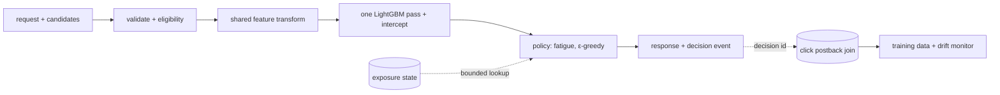

# simula-ctr

CTR prediction, candidate ranking, cold start, and drift for contextual ads inside AI companion apps. Take-home for Simula.

Code was written with AI coding tools (Codex, Claude Code). The design decisions, the feature contract, the evaluation choices, and every trade-off below are mine, and I can explain each one.

## Results in one table

Chronological split: fit on Oct 21–27, calibrate on Oct 28, test on Oct 29–30 (127,406 impressions, CTR 17.14%). Every number is from `reports/` and reproduces from the commands in **Run**.

| Model | Test log loss | Test AUC | Notes |
| --- | --- | --- | --- |
| Constant (train CTR) | 0.458740 | 0.500 | the floor |
| Lookup `app_id × C18`, smoothed | 0.438968 | 0.640 | strongest lookup baseline |
| LightGBM A: request + candidate | 0.419189 | 0.706 | |
| **LightGBM B: A + character metadata** | **0.409450** | **0.729** | shipped; chosen on the Oct 27 selection day |
| LightGBM C: B + `character_id` | 0.411285 | 0.725 | identity did not pay for itself |

B reduces log loss 6.7% relative to the strongest lookup. That is prediction quality on logged impressions, not a CTR or ROAS lift; serving value needs a controlled experiment with logged candidate sets.

Where it holds and where it doesn't (model B, calibrated):

| Slice | Rows | Actual CTR | Log loss | AUC |
| --- | --- | --- | --- | --- |
| Unseen ad (`C14` not in training), 42.9% of test | 54,602 | 14.6% | 0.372 | 0.732 |
| Seen ad | 72,804 | 19.1% | 0.437 | 0.720 |
| Seen-but-rare ad (<50 training rows) | 5,444 | 21.8% | 0.489 | 0.691 |
| Characters created inside the data window | 5,749 | 16.5% | 0.399 | 0.735 |
| Oct 29 / Oct 30 (partial, 6 hours) | 104,450 / 22,956 | 17.3% / 16.6% | 0.411 / 0.403 | 0.729 / 0.728 |

The unseen-ad slice has a lower loss because its base rate is lower, not because new ads are easier. The weak slice is seen-but-rare: thin evidence the model trusts too much.

## Decisions and what each one cost

1. **Chronological split, not random.** A random split lets the same ad sit on both sides; under it 0% of test ads are new. Under the real split 42.9% are. I report the honest number.
2. **`session_msg_count` and `num_interactions` are never features.** The first is a session total that exceeds the current turn on 78% of rows, so most values contain messages that had not happened yet. The second correlates 0.79 with how many impressions a character has in the export, so it leaks popularity, worst on new characters. Both are serve-time-availability judgments, stated as such. `conversation_turn` shows no marginal signal (χ² p=0.95) and is a time-boxed ablation I have not run.
3. **LightGBM over anything deeper.** Native categorical handling, minutes to train, one model to explain. Hyperparameters are recorded defaults, not tuned; the only data-chosen quantity is the tree count, by early stopping on Oct 27.
4. **B over C.** Adding `character_id` as a raw category lost on the selection day and on test. A new character is scored the same way as an old one: genre, safety tier, age in days.
5. **Calibration is one intercept shift, shrunk by half.** Monotone, so it never reorders candidates. Fitted on Oct 28, the lowest-CTR day in the file, immediately after the highest, so a full shift over-corrects. The shrink was chosen on development data; the margin over the alternatives was ~1e-6, so call it a prior, not a discovery.
6. **Unseen values become missing, never a bucket.** LightGBM routes them down the missing branch and still splits on everything else the row carries. There is no global "rare < 50" rule: rarity is feature-specific (`C14` 47% of test rows rare or unseen, `app_category` 0%).
7. **`C20 = -1` stays its own category.** 46.8% of rows, +3.8 pp CTR. Folding it into missing throws that away.

## Ranking (`simula/rank.py`)

One request (the moment: character, hour, site/app, device) plus a bounded list of candidates (the ad: `banner_pos` + C14–C21 + a content tier). One model row per candidate, one batch prediction.

- **Ownership is enforced.** A candidate carrying a request field is a validation error, not an override.
- **Slot belongs to the candidate**, per the assignment. The same creative in two slots is two candidates with two scores: in `fixtures/rank_requests.json` creative 15702 scores 0.314 in slot 1 and 0.240 in slot 0.
- **Hard gate:** content tier ≤ min(publisher ceiling, character `safety_tier`). Unknown character fails closed to `sfw`. Excluded candidates stay in the output with a reason.
- **Score = calibrated pCTR. Utility = pCTR / (1 + 0.5 × times_seen)**, only when explicit exposure state arrives, keyed by creative. No state → plain pCTR and `exposure_state_unavailable: true`. It is a soft discount, not a cap: with 82% of rows lacking a device id, a per-user guarantee is a promise the system cannot keep.
- **Selection: ε-greedy inside a near-tie set.** E = candidates within 0.01 of the leader; pick the leader with probability 0.95, else uniform over E. The logged number is `P(a) = (1−ε)·[a=a*] + ε·[a∈E]/|E|`, so the winner reads 0.975, not 0.95. Candidates outside E get zero probability, which bounds any future off-policy evaluation. ε and the gap are policy heuristics in config, not estimates of uncertainty.
- **Uncertainty is reported, not hidden:** raw and calibrated pCTR, unseen/rare flags for the ad and the character, exploration membership, and `indistinguishable: true` when every eligible candidate maps to the same model row.

`reports/rank_sample.json` holds the four fixture decisions: shared creative in two slots, fixed slot with a gate and a fatigue reorder, all-unseen identical candidates, no-fill.

## Cold start

| New thing | What the model uses | Evidence |
| --- | --- | --- |
| Ad never seen | its supported attributes: slot, C15–C21 (C15/C16/C18/C20 training-seen on 100% of unseen-ad rows) | 54,602 test rows, AUC 0.732 |
| Character never seen | genre, safety tier, age in days | 240 characters created in-window, 5,749 rows, AUC 0.735 |
| User with no device id | nothing user-specific; the model never used user identity | see identity table below |

**Graduation** is a rule, not a switch. At an 18% base rate, ~100 impressions put an ad's own rate within ±7.5 pp, ~2,500 within ±1.5 pp. The tree blends an entity's own history in as it accumulates through retraining; the novelty flags on every decision say which regime a candidate is in. Text descriptions were not used: all 5,000 come from 30 sentence templates, so a text model would learn templates, not characters.

## Identity (the device-id question)

82.2% of rows carry the export's null-device marker. An IP+device-model composite recurs across days for only 15.9% of test rows (37.3% for IP alone), and among null-device test rows only 18.3% have a composite seen in training. Model B on the four cells:

| Device id | IP+model key seen in training | Rows | Log loss | AUC |
| --- | --- | --- | --- | --- |
| missing | no (65% of test) | 82,855 | 0.421 | 0.727 |
| missing | yes | 18,553 | 0.389 | 0.738 |
| present | no | 24,347 | 0.386 | 0.724 |
| present | yes | 1,651 | 0.380 | 0.669 |

The model ranks about as well on the traffic with no identity at all. So the answer to "how else do you identify users" is: for prediction, you mostly don't need to; for exposure control, use publisher-provided user or session ids where permitted, scoped per publisher, with the composite key only as an offline diagnostic. I would not fingerprint devices to recover ids Apple lets users withhold.

## Drift (`simula/drift.py`, `reports/drift.md`)

CTR fell from 18.2% (Oct 21–28) to 17.1% (Oct 29–30). Time of day does not explain it: restricting both periods to hours 00–05 leaves 18.4% → 17.1%. Composition does move: between Oct 29 and Oct 30, site-side share 63% → 38%, unseen-ad share 39% → 60%, `C20=-1` share 46% → 60%; PSI against training on Oct 30 is 0.37 for `app_category`, 0.38 for `site_category`, 0.54 for `C20`, and 0.004 for `device_type`. Same devices, different inventory. That is an association on ten days of one export, not settled attribution.

Those three shares plus daily log loss are the monitor. The adaptation prototype keeps the model frozen and fits one shrunk intercept from Oct 29's labels, applied to Oct 30, strictly predict-then-update: mean prediction 16.9% → 16.7% against actual 16.6%, log loss 0.40274 → 0.40270. It corrects level, never order. It does not demonstrate fatigue reduction; nothing in this export can. Assumption stated in the report: a day's labels are usable from 00:00 the next day.

## Production sketch (<50 ms)



Warm in process: model, encoder, calibration delta, the 5,000-row character table. Called with a deadline: exposure state. Async: the decision event. Measured: in-process `rank()` on a warm bundle is p50 16 ms, p99 18 ms for 3–4 candidates (`reports/latency.md`), single core, no network. Illustrative budget, unverified end to end: 5 ms transport, 5 ms queue, 8 ms state lookup, 16 ms rank, 2 ms serialize, 14 ms headroom.

| Failure | Behaviour |
| --- | --- |
| exposure state unavailable | rank on pCTR, flag the fallback |
| character metadata missing | strictest content ceiling, flag it |
| eligibility authority unavailable | no-fill for affected candidates, never a relaxed ceiling |
| model unavailable | bounded fallback order over eligible candidates |
| rollout | validate and warm model + encoder + delta as one artifact, swap atomically, keep rollback |
| logging | decision id, candidate set, chosen action's probability, model/policy versions; an impression is not a negative until the label window closes |

## What I did not do

Hyperparameter sweep, target encoding, text embeddings, a reserved-character holdout, per-segment drift correction, budget pacing, an HTTP service. Each is the next rung of something here, and none changes a reported number. The ablation matrix stops at A/B/C; `conversation_turn`, `C20`-as-missing, and the categorical smoothing settings are listed, not run.

## Run

```bash
uv sync
# data/impressions.csv and data/characters.csv (not committed)
uv run python cli.py evaluate --baseline
uv run python cli.py train --out bundle
uv run python cli.py evaluate --model bundle
uv run python cli.py rank --requests fixtures/rank_requests.json --model bundle --out reports/rank_sample.json --bench 300
uv run python cli.py drift --model bundle
uv run pytest -q          # 30 tests on the committed 5,000-row fixture
# --smoke on any command runs the fixture instead of the data; it overwrites bundle/ and reports/
```

Layout: `simula/data.py` (windows, join, flags) · `features.py` (the contract) · `baselines.py` · `train.py` (fit, refit, calibrate, bundle) · `evaluate.py` (slices, reliability) · `rank.py` · `drift.py` · `cli.py`.

## Ranking payload

`rank` reads a JSON list of payloads. `device_id` may be null or absent; `conversation_turn` and `session_msg_count` are accepted, echoed, and never used by the model. Every policy field in the fixtures (`content_tier`, `publisher`, `exposure`) is demonstration data.

```json
{
  "id": "request-1",
  "request": {
    "hour": 14102900, "character_id": "...", "site_id": "...", "site_domain": "...",
    "site_category": "...", "app_id": "...", "app_domain": "...", "app_category": "...",
    "device_id": null, "device_ip": "...", "device_model": "...", "device_type": 1,
    "device_conn_type": 0, "C1": 1005
  },
  "candidates": [{
    "candidate_id": "ad-1", "content_tier": "sfw", "banner_pos": 0,
    "C14": 20345, "C15": 300, "C16": 250, "C17": 2331,
    "C18": 2, "C19": 39, "C20": "-1", "C21": 23
  }],
  "publisher": {"max_content_tier": "suggestive"},
  "exposure": {"key": "opaque", "window": "24h", "counts": {"20345": 3}},
  "seed": 7
}
```

Each result reports the selected candidate or no-fill, the effective ceiling, degraded-state flags, versions, and one row per candidate with rank, exclusion reason, raw and calibrated pCTR, utility, novelty flags, exploration membership, and selection probability.

Schema note: the impression columns match the public Avazu benchmark; its published baselines were a sanity check for the model numbers.
